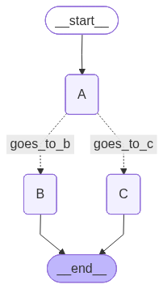

# 🧠 Estudo — LangChain & LangGraph

> Repositório de estudo prático sobre **LangChain** e **LangGraph**, explorando desde conceitos fundamentais de RAG até a construção de grafos de estado com fluxos condicionais.

---

## 📑 Índice

- [Visão Geral](#-visão-geral)
- [Stack Tecnológica](#-stack-tecnológica)
- [Arquitetura do Projeto](#-arquitetura-do-projeto)
- [Conceitos Fundamentais](#-conceitos-fundamentais)
  - [Documentos](#1-documentos-a-matéria-prima)
  - [Chunks](#2-chunks--fragmentação-recorte)
  - [Embeddings](#3-embeddings-a-tradução-para-números)
  - [Vector Database](#4-vector-database--vetorização-o-arquivo-de-aço)
  - [Retrieval](#5-retrieval--recuperação-a-busca-por-similaridade)
  - [RAG](#6-rag---retrieval-augmented-generation-a-estratégia)
  - [LiteLLM](#7-litellm-o-tradutor-universal--gateway)
  - [LLM](#8-llm---large-language-model-o-cérebro)
- [LangChain — Fundamentos](#-langchain--fundamentos)
  - [Messages](#messages)
  - [Chat Model Factory](#chat-model-factory)
- [LangGraph — Grafos de Estado](#-langgraph--grafos-de-estado)
  - [Grafo Simples](#1-grafo-simples-state_simplepy)
  - [Grafo Condicional](#2-grafo-condicional-state_conditionalpy)
- [Infraestrutura](#-infraestrutura)
- [Como Executar](#-como-executar)
- [Referências](#-referências)

---

## 🔭 Visão Geral

Este projeto é um laboratório de aprendizado que cobre:

| Tema | Descrição |
|------|-----------|
| **LangChain** | Framework para construção de aplicações com LLMs — mensagens, prompts, modelos de chat |
| **LangGraph** | Extensão do LangChain para orquestração de agentes via grafos de estado |
| **LiteLLM** | Gateway/proxy que padroniza a comunicação com diferentes provedores de LLM |
| **Ollama** | Execução local de modelos (Qwen3 8B) |

---

## 🛠 Stack Tecnológica

| Tecnologia | Versão / Detalhes |
|---|---|
| Python | `3.14` |
| LangChain | `>=1.2.14` |
| LangChain OpenAI | `>=1.1.12` |
| LiteLLM | via Docker |
| Ollama | Local — modelo `qwen3:8b` |
| Rich | `>=14.3.3` (output formatado no terminal) |
| uv | Gerenciador de pacotes |

---

## 📁 Arquitetura do Projeto

```
.
├── config.yaml            # Configuração do LiteLLM (modelos, parâmetros)
├── docker-compose.yaml    # Container do LiteLLM proxy
├── factory.py             # Factory pattern — inicialização de Chat Model e Embeddings
├── main_langchain.py      # Exemplo básico de LangChain (mensagens + LLM)
├── state_simple.py        # LangGraph — grafo de estado simples (linear)
├── state_conditional.py   # LangGraph — grafo de estado com edges condicionais
├── graph.png              # Visualização gerada do grafo
├── pyproject.toml         # Dependências e metadados do projeto
├── .python-version        # Versão do Python (3.14)
└── .env                   # Variáveis de ambiente (não versionado)
```

---

## 📚 Conceitos Fundamentais

### 1. Documentos (A Matéria-Prima)
São seus arquivos (PDFs, TXT, DOCX). Eles contêm o conhecimento bruto que a IA ainda não conhece, pois não fez parte do treinamento original dela.

### 2. Chunks / Fragmentação (Recorte)
Como os documentos podem ser gigantes, o **LangChain** corta o texto em pedaços menores (ex: parágrafos de 500 caracteres).
> 💡 É como cortar um livro em fichas bibliográficas para facilitar a localização de uma informação específica depois.

### 3. Embeddings (A Tradução para Números)
É um modelo matemático que transforma cada pedaço de texto em uma lista de números (vetores).
> 💡 É a ponte entre a linguagem humana e a máquina. O "Embedding" entende que "cachorro" e "pet" são numericamente próximos, mesmo sendo palavras diferentes.

### 4. Vector Database / Vetorização (O Arquivo de Aço)
É o banco de dados onde esses números (vetores) ficam guardados e organizados por "vizinhança".
> 💡 Imagine um mapa 3D onde assuntos parecidos moram no mesmo bairro. Isso permite que a busca seja instantânea.

### 5. Retrieval / Recuperação (A Busca por Similaridade)
Quando o usuário faz uma pergunta, ela também vira um vetor e o sistema vai ao banco buscar os "vizinhos" mais próximos.
> 💡 É o "filtro" que separa o que é útil para aquela pergunta específica no meio de milhares de documentos.

### 6. RAG - Retrieval-Augmented Generation (A Estratégia)
É o nome de todo esse processo de "recuperar para gerar". É a técnica de dar um "livro aberto" para a IA consultar antes de responder.
> 💡 Sem o RAG, a IA tenta adivinhar (alucinar). Com o RAG, ela consulta o fato antes de falar.

### 7. LiteLLM (O Tradutor Universal / Gateway)
Uma ferramenta que padroniza a conversa com diferentes "cérebros".
> 💡 Ele serve para que o seu código fale uma língua só, não importa se você está usando o Ollama local ou uma IA paga na nuvem.

### 8. LLM - Large Language Model (O Cérebro)
É o motor (ex: Llama 3 via Ollama) que recebe o texto recuperado e a pergunta do usuário.
> 💡 Ele não guarda os dados, ele apenas **processa**. Ele lê o que o RAG entregou e redige uma resposta coerente e educada.

### Fluxo Completo do RAG

```
Documento → Chunks → Embeddings → Vector DB
                                       ↓
Pergunta do Usuário → Embedding → Busca por Similaridade
                                       ↓
                              Contexto Recuperado + Pergunta → LLM → Resposta
```

---

## ⛓ LangChain — Fundamentos

### Messages

O LangChain trabalha com tipos de mensagens tipadas para estruturar a comunicação com o LLM:

| Tipo | Classe | Propósito |
|------|--------|-----------|
| **System** | `SystemMessage` | Define o comportamento/persona da IA |
| **Human** | `HumanMessage` | Pergunta ou instrução do usuário |
| **AI** | `AIMessage` | Resposta gerada pelo modelo |

**Exemplo prático** — [`main_langchain.py`](main_langchain.py):

```python
from langchain_core.messages import HumanMessage, SystemMessage

system_message = SystemMessage(
    "Você é um assistente astronomo. "
    "Seu objetivo é me ajudar a entender o sistema solar."
)

human_message = HumanMessage("Qual é o planeta mais próximo ao sol?")

response = llm.invoke([system_message, human_message])
```

### Chat Model Factory

O [`factory.py`](factory.py) implementa o **Factory Pattern** para centralizar a criação de instâncias do modelo:

```python
# Chat Model — para conversação
def get_chat_model():
    return init_chat_model(
        model=MODEL_NAME,
        model_provider="openai",  # Interface OpenAI-compatible (via LiteLLM)
        api_key=API_KEY,
        base_url=BASE_URL,
        temperature=0,
    )

# Embeddings — para vetorização de texto
def get_embeddings():
    return init_embeddings(
        model=MODEL_NAME,
        provider="openai",
        api_key=API_KEY,
        base_url=BASE_URL,
        model_kwargs={"encoding_format": "float"},  # Compatibilidade Ollama
    )
```

> ⚙️ As variáveis `MODEL_NAME`, `API_KEY`, `BASE_URL` e `MAX_ITERATIONS` são carregadas do arquivo `.env` via `python-dotenv`.

---

## 🔀 LangGraph — Grafos de Estado

O **LangGraph** permite modelar fluxos de execução como **grafos dirigidos**, onde:

| Conceito | Descrição |
|----------|-----------|
| **State** | Estrutura de dados compartilhada entre todos os nós |
| **Node** | Função que recebe o estado, processa e retorna o estado atualizado |
| **Edge** | Conexão entre nós (define a ordem de execução) |
| **Conditional Edge** | Aresta que escolhe o próximo nó com base em uma condição |
| **Reducer** | Função que define como o estado é mesclado (ex: `add_messages` para acumular listas) |

### 1. Grafo Simples — [`state_simple.py`](state_simple.py)

Fluxo linear: `START → A → B → END`

```python
# 1 — Definir o Estado com Reducer
class StateSimple(TypedDict):
    nodes_path: Annotated[list[str], add_messages]  # acumula valores

# 2 — Definir os Nodes
def node_a(state: StateSimple) -> StateSimple:
    return {"nodes_path": ["A"]}

def node_b(state: StateSimple) -> StateSimple:
    return {"nodes_path": ["B"]}

# 3 — Montar o Grafo
builder = StateGraph(StateSimple)
builder.add_node("A", node_a)
builder.add_node("B", node_b)

# 4 — Conectar as Arestas
builder.add_edge("__start__", "A")
builder.add_edge("A", "B")
builder.add_edge("B", "__end__")

# 5 — Compilar e Executar
graph = builder.compile()
response = graph.invoke({"nodes_path": []})
```

**Conceitos-chave aprendidos:**
- O `Annotated[list[str], add_messages]` define um **reducer** — ao invés de substituir o valor, ele **acumula** (append)
- Alternativas de reducer: `operator.add`, lambda `lambda a, b: a + b`, ou função customizada
- `__start__` e `__end__` são nós especiais do LangGraph

### 2. Grafo Condicional — [`state_conditional.py`](state_conditional.py)

Fluxo com bifurcação: `START → A → (condição) → B ou C → END`

```python
# 1 — Estado com dataclass (alternativa ao TypedDict)
@dataclass
class StateConditional:
    nodes_path: Annotated[list[str], add_messages]
    current_number: int = 0  # campo extra para a condição

# 2 — Função condicional (decide o caminho)
def conditional_function(state: StateConditional) -> Literal["B", "C"]:
    if state.current_number >= 50:
        return "goes_to_c"
    return "goes_to_b"

# 3 — Montar o Grafo com Conditional Edges
builder = StateGraph(StateConditional)
builder.add_node("A", node_a)
builder.add_node("B", node_b)
builder.add_node("C", node_c)

builder.add_edge(START, "A")
builder.add_conditional_edges("A", conditional_function, {
    "goes_to_b": "B",  # mapeamento: retorno da função → nome do nó
    "goes_to_c": "C"
})
builder.add_edge("B", END)
builder.add_edge("C", END)

graph = builder.compile()
response = graph.invoke(StateConditional(nodes_path=[], current_number=51))
```

**Conceitos-chave aprendidos:**
- `@dataclass` pode ser usado como alternativa ao `TypedDict` para definir estados
- `add_conditional_edges` recebe: nó de origem, função de decisão e mapeamento de rotas
- O mapeamento `{"goes_to_b": "B"}` traduz o retorno da função para o nome real do nó
- `START` e `END` são constantes importadas de `langgraph.graph`

### Visualização do Grafo

O LangGraph permite gerar imagens do grafo para visualização:

```python
graph.get_graph().draw_mermaid_png(output_file_path='graph.png')
```

<p align="center">
  
</p>

---

## 🐳 Infraestrutura

### LiteLLM Proxy (via Docker)

O projeto usa o **LiteLLM** como proxy/gateway para padronizar a interface com o Ollama local:

**[`docker-compose.yaml`](docker-compose.yaml):**
```yaml
services:
  litellm:
    image: litellm/litellm
    ports:
      - "4000:4000"
    volumes:
      - ./config.yaml:/app/config.yaml
    command: ["--config", "/app/config.yaml", "--detailed_debug"]
    extra_hosts:
      - "host.docker.internal:host-gateway"  # Acesso ao Ollama no host
```

**[`config.yaml`](config.yaml):**
```yaml
model_list:
  - model_name: ai-angelo-zero
    litellm_params:
      model: ollama/qwen3:8b
      api_base: "http://host.docker.internal:11434"
      drop_params: True       # Suporte a base64
      temperature: 0
      extra_body:
        repeat_penalty: 1.2   # Reduz repetição nas respostas
```

### Diagrama da Infraestrutura

```
┌─────────────────┐     ┌──────────────────┐     ┌─────────────┐
│   Python App    │────▶│  LiteLLM Proxy   │────▶│   Ollama    │
│  (LangChain)    │     │  (Docker :4000)  │     │  (qwen3:8b) │
│                 │◀────│                  │◀────│  (:11434)   │
└─────────────────┘     └──────────────────┘     └─────────────┘
```

---

## 🚀 Como Executar

### Pré-requisitos

- [Python 3.14+](https://www.python.org/)
- [uv](https://docs.astral.sh/uv/) (gerenciador de pacotes)
- [Docker](https://www.docker.com/) e Docker Compose
- [Ollama](https://ollama.ai/) com o modelo `qwen3:8b` instalado

### 1. Clonar e instalar dependências

```bash
git clone <repo-url>
cd python-langchain-langgraph-project
uv sync
```

### 2. Configurar variáveis de ambiente

Crie um arquivo `.env` na raiz do projeto:

```env
MODEL_NAME=ai-angelo-zero
API_KEY=sk-1234
BASE_URL=http://localhost:4000/v1
MAX_ITERATIONS=10
```

### 3. Subir o LiteLLM

```bash
docker compose up -d
```

### 4. Executar os exemplos

```bash
# LangChain — Chat básico com mensagens
uv run python main_langchain.py

# LangGraph — Grafo de estado simples (linear)
uv run python state_simple.py

# LangGraph — Grafo de estado condicional
uv run python state_conditional.py
```

---

## 📖 Referências

- [LangChain Documentation](https://python.langchain.com/docs/)
- [LangGraph Documentation](https://langchain-ai.github.io/langgraph/)
- [LiteLLM Documentation](https://docs.litellm.ai/)
- [Ollama](https://ollama.ai/)
- [RAG — Retrieval-Augmented Generation (Paper)](https://arxiv.org/abs/2005.11401)

---

<p align="center">
  <sub>📝 Repositório de estudo — Angelo</sub>
</p>
